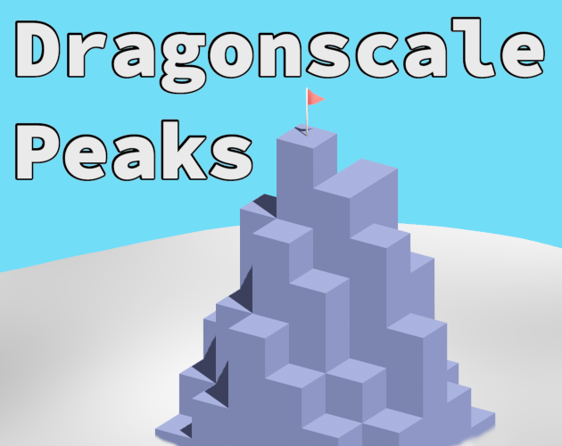

# Dragonscale Peaks

  

A game made for the GitHub Game Off 2023 game jam. The theme was: scale.

It's a puzzle game about climbing mountains with limited stamina.

You can play it in your browser on itch.io [here](https://louisnivrat.itch.io/dragonscale-peaks).

---

### License

Licensed under either of

 * Apache License, Version 2.0, (http://www.apache.org/licenses/LICENSE-2.0)
 * MIT license (http://opensource.org/licenses/MIT)

at your option.
